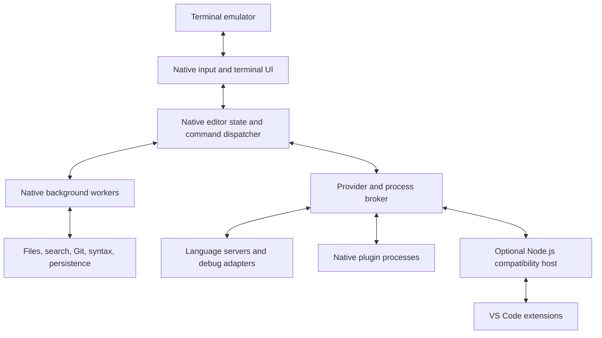

# VSCLI architecture

## Product decision

Build a Rust terminal IDE for developers who want VS Code's ordinary editing model, command discovery, language tools, and project navigation inside a terminal. The first audience is developers using SSH, containers, and terminal workflows who do not want to learn modal editing or assemble a large editor configuration.

The defining experience is: open a repository, use the exact VS Code shortcuts for the selected operating-system profile, navigate and edit code, inspect diagnostics, search, and use Git with minimal setup. Exact keybindings are a user requirement, including chords, context-dependent behavior, and imported overrides. Core workflows should remain responsive while language tools or extensions are busy.

Working assumptions are a solo full-time maintainer initially, community contributions later, Linux as the first reference platform, macOS included in the first public alpha, and Windows as a separate validation milestone. The design permits an optional JavaScript extension runtime. If “entirely native” means no JavaScript runtime anywhere, remove that compatibility host and narrow the extension promise accordingly. Language servers and other external tools may themselves use managed runtimes.

## Compatibility boundaries

There are three independent constraints:

1. Existing desktop VS Code extensions normally execute in Node.js. A native UI does not remove that runtime dependency. Browser-only extensions have a different execution environment. [VS Code extension hosts](https://code.visualstudio.com/api/advanced-topics/extension-host).
2. Webviews expose HTML interfaces controlled by extensions. Arbitrary interactive webviews cannot retain their full behavior in a character-cell interface without a browser environment and a different presentation strategy. [Webview API](https://code.visualstudio.com/api/extension-guides/webview).
3. Legacy terminal input can collapse distinct keys into identical byte sequences. Enhanced keyboard protocols improve this, but an application cannot recover shortcuts intercepted by the operating system or terminal. [Kitty keyboard protocol](https://sw.kovidgoyal.net/kitty/keyboard-protocol/).

These constraints require visible capability reporting. They do not prevent an excellent IDE. The detailed contract is in [Compatibility](COMPATIBILITY.md).

Resolve keyboard transport conflicts through supported terminal/multiplexer configurations and enhanced input protocols. Do not substitute different editor shortcuts to satisfy the exact-keybinding requirement. Platforms that cannot deliver required events remain unqualified until configuration or integration resolves the issue. The existing terminal-only fallback can remain usable, but must not be represented as exact compatibility.

## Alternatives and decision

| Approach | Benefit | Architectural cost | Decision |
| --- | --- | --- | --- |
| New Rust core using established libraries | Own editing semantics, latency, and terminal experience | Must implement a reliable editor and compatibility services | Recommended, subject to feasibility gates |
| Neovim distribution or embedded Neovim | Reuse a mature editor and its ecosystem | VS Code editing semantics, extension API, and default behavior still need substantial adaptation | Best fallback if early delivery outweighs owning the model |
| Adapt an existing Rust terminal editor | Reuse buffers, syntax, and language infrastructure | Existing editing assumptions, internal coupling, and source licenses shape the product | Evaluate reusable components; avoid assuming a fork is cheaper |
| Code OSS with a new terminal frontend | Closer starting point for VS Code services | Large TypeScript service graph remains; desktop UI cannot simply be swapped for a TUI | Use as reference and possible compatibility-host source |
| Eclipse Theia based workbench | Existing VS Code extension interoperability work | Web-oriented workbench and substantial service adaptation | Study compatibility techniques; not the native core |

Neovim exposes an embedding/API surface, and Helix demonstrates Rust terminal editing with multiple selections, language servers, and Tree-sitter. Neither fact establishes that their editing models are drop-in VS Code replacements. [Neovim API](https://neovim.io/doc/user/api/), [Helix source](https://github.com/helix-editor/helix).

The recommendation is an engineering judgment, not a claim that a new core will automatically be faster. Phase 0 must compare a thin new-core prototype against reuse before committing to years of implementation.

## Architecture and process ownership



The UI, editor state, and native services begin in one executable. Threads and asynchronous tasks provide concurrency; separate processes are used for extensions and external tools. Do not create a service process per native module or require a resident daemon just to edit a file.

The editor event loop is the sole writer of live document, selection, and workbench state. Background work receives immutable snapshots and returns versioned results. The renderer consumes a view snapshot and owns terminal output. Neither language servers nor extension hosts own the authoritative document.

The input-to-display path is:

`input → normalize key/text → resolve command → apply transaction → update visible layout → write changed cells`

No extension callback, filesystem operation, network request, synchronous parser run, or language-server response may be a prerequisite for displaying an ordinary edit. Features such as formatting and extension-provided commands can complete asynchronously and display their progress.

Use bounded queues, cancellation, request deadlines, and priorities. Input and document commits outrank background indexing. Coalesce superseded work such as search queries and viewport refreshes, while preserving required document-event ordering. A blocked terminal writer must not permit unbounded frame accumulation: retain the latest desired frame and diff against the last frame actually written.

## Initial technology choices

| Responsibility | Proposed choice | Reason and qualification |
| --- | --- | --- |
| Core and native services | Rust, stable toolchain | Memory safety, explicit ownership, native binaries, reusable library ecosystem |
| Terminal UI | Ratatui and Crossterm | Reuse layout, cell buffers, terminal lifecycle, and input; implement an editor-specific widget |
| Text storage | Ropey behind a document abstraction | Start with an established UTF-8 rope; validate indexing, snapshots, and long-line behavior |
| Syntax | Tree-sitter with a curated grammar set | Incremental syntax; grammar updates need independent validation |
| Language intelligence | Native LSP client | Standard protocol, independent of VS Code extensions |
| Debugging | Native DAP client | Native controls with separately installed adapters |
| Search | ripgrep subprocess initially | Mature ignore handling and structured streaming output |
| Git | Git CLI with machine-readable output | Reuse user configuration and mature behavior; revisit library integration only for measured needs |
| Async work | Tokio for I/O; bounded blocking/CPU workers | Keep expensive parsing and filesystem work off the interaction loop |
| Compatibility host | TypeScript on a pinned, maintained Node.js runtime | Run JavaScript extensions while keeping the native editor independent |
| First-party persistence | Versioned files and a recoverable journal | Avoid making a database a prerequisite for text editing |

The cited projects establish these libraries' purposes, not that the complete stack meets our budgets: [Ratatui](https://ratatui.rs/), [Crossterm](https://github.com/crossterm-rs/crossterm), [Ropey](https://github.com/cessen/ropey), [Tree-sitter](https://tree-sitter.github.io/tree-sitter/), [ripgrep](https://github.com/BurntSushi/ripgrep). Pin exact versions only after the feasibility experiments, license inventory, and platform checks.

## Document model and editing semantics

Each document has a stable ID, URI, monotonic version, encoding, line-ending policy, and saved revision. Each view owns its selections, scroll position, wrapping, and folding state. Multiple panes can view one document without duplicating its text history.

Represent edits as validated transactions over a specific document version. A transaction contains non-overlapping replacements, selection mapping, undo-group metadata, and origin. Multi-cursor typing, snippets, refactors, formatters, and plugin edits must use this same pathway. Define overlapping-selection behavior explicitly; use differential tests for VS Code-compatible commands.

Keep four coordinate spaces distinct: UTF-8 bytes, Unicode scalar values, UTF-16 code units, and displayed terminal cells. Cursor motion follows grapheme boundaries; display width depends on terminal behavior. VS Code positions use UTF-16, while LSP position encodings are negotiated. Cache conversions at rope chunks or line checkpoints. Never interpret an API column as a terminal-cell column. [VS Code API](https://code.visualstudio.com/api/references/vscode-api), [LSP specification](https://microsoft.github.io/language-server-protocol/specifications/lsp/3.17/specification/).

Undo restores text and selections and uses deliberate grouping boundaries for typing, snippets, and programmatic edits. Maintain bounded history and snapshot retention. Do not implement collaborative editing or CRDTs in the initial core; neither is required for local undo or extension synchronization.

Every background request carries a document version. Reject or recompute stale edit results. Use an explicitly tested position-mapping mechanism where safe; never blindly apply an old formatter's byte offsets to new text. Stale diagnostics can be discarded or visibly marked until refreshed.

Workspace edits need preflight validation across affected buffers. Multi-buffer memory changes can be committed as a group, but filesystem rename/create/delete operations are not universally atomic. Report partial failures with recovery information instead of claiming all-or-nothing disk transactions.

## Files, recovery, and large documents

Model resources as URIs and use a filesystem-provider boundary from the beginning. Start with local files. Preserve permissions, encoding, BOM, and newline choices; explicitly handle symlinks and external modifications. Never silently replace undecodable bytes. Initially offer a read-only view or an explicit encoding choice for unsupported files.

Saving should use a sibling temporary file and replacement where appropriate, with platform-specific handling for metadata, links, sharing violations, and durability. Detect disk changes before overwriting and offer reload, compare, or merge. Atomic replacement is not a complete strategy for every filesystem or symlink arrangement.

Keep a versioned recovery journal with periodic snapshots, bounded compaction, and a documented flush interval. An edit is not crash-durable until its journal data is flushed. Recovery tests must cover killed processes, truncated journal records, disk-full errors, and externally changed files. Restore terminal modes on normal exit and recoverable failures; SIGKILL and power loss need separate recovery expectations.

Define a large-file mode based on measured size, line length, and memory cost. It can defer syntax, semantic features, wrapping, and unrestricted history, while preserving basic navigation and explicit user feedback. A huge single line is a separate benchmark from many short lines. Do not promise unrestricted editing of arbitrary-size files in a fixed memory budget.

## Terminal workbench

Use ordinary typing and selection by default. Optional modal keymaps can follow later. Provide a compact file explorer, editor tabs and splits, command palette, quick open, search results, problems list, output panel, terminal panel, and status bar. At narrow widths collapse panels and preserve access through commands.

```text
 project                         src/main.rs   README.md
 ┌ Files ─────────┬────────────────────────────────────────┐
 │ src/           │  1  fn main() {                         │
 │   main.rs      │  2      println!("hello");              │
 │ Cargo.toml     │  3  }                                   │
 ├────────────────┴────────────────────────────────────────┤
 │ Problems 2   Output   Terminal                          │
 │ src/main.rs:8:5  error message                          │
 └ main*  Rust  UTF-8  Ln 2, Col 12  Commands: F1 ──────────┘
```

Keep visual decoration inexpensive and optional. Support plain text labels without patched fonts, limited-color terminals, configurable contrast, and an accessibility mode with predictable focus and readable status output. Validate screen-reader interaction with real users; a TUI does not inherit desktop accessibility automatically. IME composition, bidirectional scripts, combining marks, and emoji require explicit testing and documented terminal limits.

Render only visible rows plus a small margin. Cache line layout by document version, wrap width, tabs, folds, decorations, and terminal width policy. A dirty-cell renderer still performs poorly if upstream code lays out an entire file on each keystroke. Keep giant trees and result lists virtualized, and limit decorations per frame.

Treat cursor styles, true color, hyperlinks, synchronized output, mouse events, clipboard protocols, and enhanced keyboard reporting as negotiated capabilities. Maintain a conservative fallback path and restore protocol state after suspension/resume. Do not depend on terminal images for any core workflow.

## Language tools, tasks, Git, and debugging

Language services register providers through a common broker. The broker identifies each provider's origin and resolves priority; direct LSP and an extension-provided server must not start duplicate instances by default. A direct LSP connection supplies language features, not the full feature set of that language's VS Code extension.

Implement initialization/capability negotiation, incremental synchronization, cancellation, workspace folders, configuration, diagnostics, completion, hover, definitions, references, rename, formatting, code actions, semantic tokens, and inlay hints in stages. Merge results with explicit rules. Keep provisioning separate from LSP itself: server installation and updates require language-specific recipes and license checks.

The task runner handles variable resolution, environment, working directory, cancellation, process versus shell execution, and problem matchers. Import supported subsets of `tasks.json` and `launch.json`; unsupported task types or debug configurations must be identified. DAP standardizes communication with debug adapters, not how every adapter is installed or configured. [DAP overview](https://microsoft.github.io/debug-adapter-protocol/overview.html).

Git starts with status, diffs, stage/unstage, and commits, using structured output and asynchronous execution. Credentials remain with existing Git helpers. Merge conflict resolution and history navigation follow after data-safety tests.

An integrated terminal needs a PTY plus a terminal-emulation state machine, scrollback, resize handling, input forwarding, and nested escape-sequence policy. Evaluate a reusable terminal core such as `alacritty_terminal`; do not assume a byte parser alone implements a terminal. Initially, external command execution can suspend and restore the editor. The integrated panel is a separate milestone. [Alacritty source](https://github.com/alacritty/alacritty).

## Extensions and trust boundaries

Provide two extension routes: native or user-selected executable plugins over a versioned RPC protocol, and existing compatible VS Code extensions in an optional Node host. Begin with one host per workspace/runtime group; extension dependencies can exchange live JavaScript objects, so arbitrary per-extension process separation is not transparent.

Use a framed, versioned protocol with request IDs, cancellation, bounded payloads, typed schemas, and a handshake. JSON-RPC is a practical initial choice. Separate transport from message types so encoding can change if profiling justifies it. Restarted peers receive a new session epoch, invalidate old handles, and resynchronize snapshots.

A child process provides fault containment, not a filesystem or network sandbox. Ordinary Node extensions can access host resources directly. Workspace trust must prevent automatic activation, tasks, debug launches, and workspace-specified executables before trust is granted. OS sandboxing, if added, needs a separate threat model and compatibility profile.

Sanitize filenames, diagnostics, and other untrusted text before rendering; terminal control bytes are not ordinary text. Bound plugin output, archive extraction, and decompression. Store secrets through an OS credential service where available and document any fallback. Never include secrets or source text in ordinary diagnostic logs.

## Remote development

First support running the complete editor inside an existing SSH or container session. This delivers useful remote editing without a distributed document system.

Later, a local native UI can connect to a workspace agent over SSH stdio. Local text edits and rendering remain local; remote services handle files, tools, Git, and workspace extensions. This introduces replicated documents, versioned edit acknowledgements, reconnect recovery, conflict handling, and local-versus-remote extension placement. Treat it as its own release program, not a transport flag.

Use existing SSH authentication and host verification. Do not require a public listening service. Design URIs and service interfaces now, but defer a remote daemon, collaboration, and cross-device synchronization until local reliability is established.

## Proposed performance budgets

These are hypotheses for Phase 0, not promises or existing measurements. Reference conditions: release build on a recorded Linux machine with at least four modern CPU cores, 16 GB RAM, local SSD, 120 by 40 terminal cells, and no extension host or language server unless specified.

| Metric | Initial target | Measurement boundary |
| --- | --- | --- |
| Warm launch to editable 100 KB file | p95 under 100 ms | Process start through first usable frame, not language readiness |
| Cold launch on the same machine | p95 under 300 ms | Record filesystem-cache procedure explicitly |
| Ordinary key handling | p95 under 4 ms; p99 under 8 ms | Input receipt through frame submission, not physical pixels |
| Physical local input-to-display | p95 under 16 ms on a suitable display | Separate end-to-end experiment including terminal/compositor |
| Idle native editor memory | Under 50 MiB RSS | Empty workspace; report all child processes separately |
| Idle native CPU | Under 0.5% of one core averaged over 60 seconds | No active tasks; disclose cursor blink and watcher activity |
| Quick-open query after index is ready | p95 under 50 ms | 100,000-path fixture; indexing time reported separately |
| Open a 10 MB ordinary source-like file | First usable view under 250 ms warm | Syntax can still be loading; include peak memory |

Measure extension-enabled total memory and CPU as well; a small parent process does not make the whole IDE lightweight. Test editing while a CPU-heavy host, language server, and search job run. Process separation cannot prevent system-wide CPU or memory contention, so enforce concurrency and queue limits and expose resource use.

Compare with pinned VS Code, Neovim, and Helix versions under documented equivalent workloads. Report empty-editor and comparable-feature results separately, warm and cold runs, median and tail latency, terminal output bytes, and fixture hashes. Avoid a general “faster” claim until the relevant workloads establish it.

## Repository boundaries

Start with a small Cargo workspace: `core`, `terminal`, `services`, and the `vscli` binary. Keep the optional TypeScript compatibility host in `compat/`. Extract finer crates only when there are real boundaries and maintainers.

The core must not import terminal libraries, Node integration, or platform UI types. Terminal widgets render core view models. Services implement file/tool/provider interfaces. The compatibility host depends on a versioned protocol, never on Rust's in-memory ABI.

Keep protocol fixtures, benchmark fixtures, compatibility results, terminal traces, and architectural decisions in the repository. The same headless core must be usable by tests without a terminal. Avoid an in-process third-party Rust ABI, a general-purpose distributed event bus, a custom UI language, and a second editor state model inside the compatibility layer.
